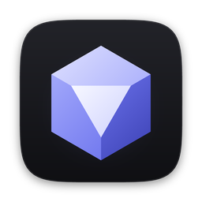
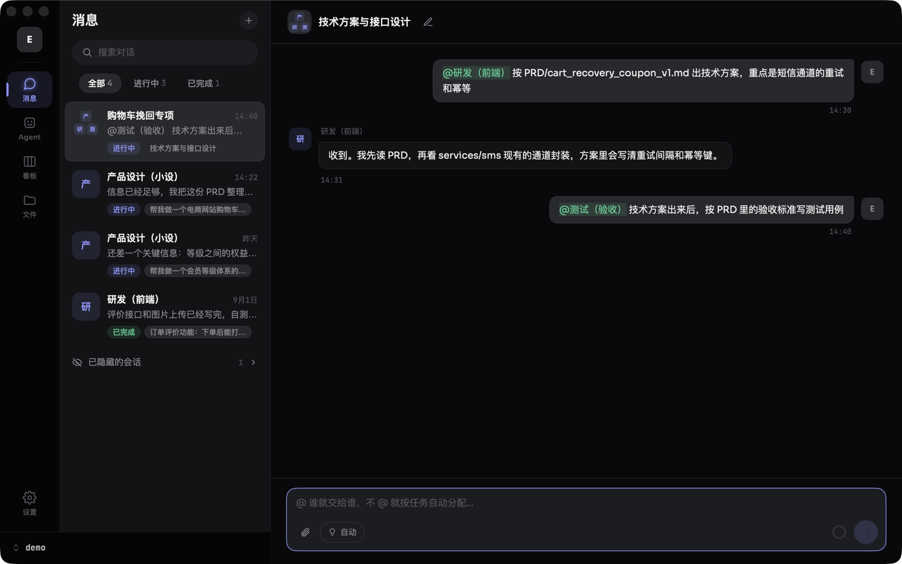
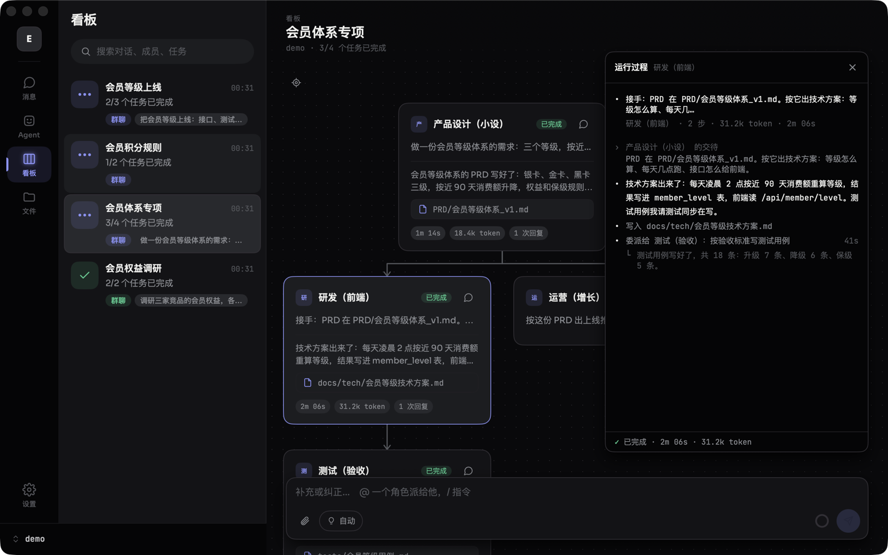
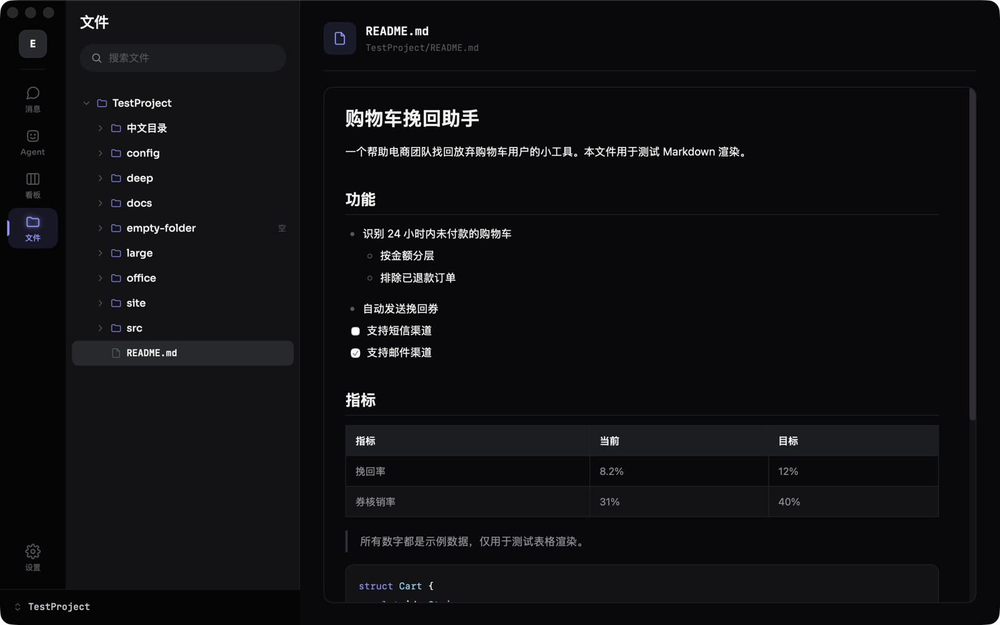
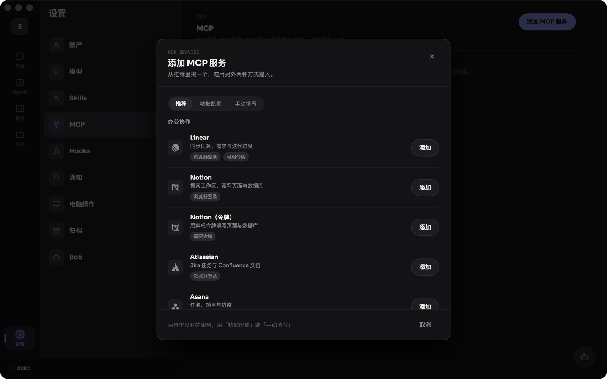
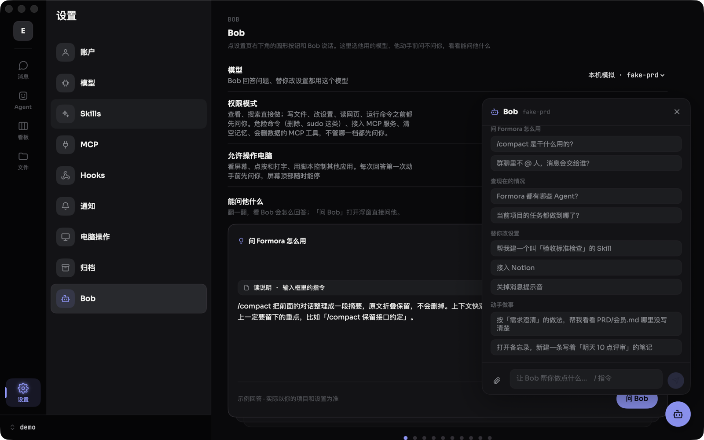

<p align="center">
  
</p>

<h1 align="center">Formora</h1>

<p align="center">给独立开发者的 macOS 多 Agent 工作台</p>

每个 Agent 对应一个真实岗位——产品设计、研发、测试、数据分析、运营——一个需求在这些岗位之间流转。你是老板，Agent 是替你干活的同事：它们在你的项目文件夹里读写文件、跑命令、上网查资料，每一步都摆在你眼前，要紧的步骤等你点头。

Formora 是原生的 macOS 应用（SwiftUI），不需要自己的服务器：模型用你自己的 API Key 直接调用，对话、文件和记忆都留在你的电脑上。

<p align="center"></p>

## 截图

| | |
|---|---|
|  |  |
| **看板**：一次派活一张卡片，谁交给了谁用线连着，点开看「运行过程」 | **Agent**：主模型、备用模型、权限模式、旁审、允许操作电脑 |
|  |  |
| **文件**：项目文件树和预览，Agent 写的文件都在这里 | **MCP**：30 个推荐服务，多数一键接入 |
|  |  |
| **单聊**：Agent 先把需求问清楚，再动手 | **Bob**：设置里的助手，替你接服务、建 Skill、改设置 |

## 下载安装

1. 到 [Releases](https://github.com/Eugeneheng1020/Formora-App/releases) 下载最新的 `Formora-<版本>.dmg`。
2. 打开 dmg，把 Formora 拖进「应用程序」。
3. 第一次打开时，macOS 会提示无法验证开发者：这个版本还没有经过苹果公证。到「系统设置 → 隐私与安全性」，在页面下方找到 Formora，点「仍要打开」；或者在「应用程序」里按住 Control 键点 Formora，选「打开」。之后就能正常打开了。

装过 1.0.3 或更新版本后，有新版本时 Formora 会自己提示更新（菜单「Formora → 检查更新…」也能查）。需要 macOS 14 或更新。用之前准备一个模型服务商的 API Key：OpenAI、Anthropic、Google Gemini、DeepSeek、通义千问等，或者任何兼容 OpenAI 接口的服务。Key 存在 macOS 钥匙串里。

## 它能做什么

### 项目

- 一个项目就是你电脑上的一个文件夹。对话和 Agent 写的文件都跟着项目走，你在 Finder 里看到的就是同样的文件。
- 左下角切换项目、新建项目（建一个新的空文件夹）、打开已有项目、管理项目（改路径、写简介；删除只从 Formora 里移除，不删任何文件）。
- Agent 只能进你授权给它的项目。

### 消息：单聊和群聊

- 单聊找一个 Agent；群聊里 @ 谁就交给谁，@ 几个就依次回答，不 @ 就按任务性质自动分配，并写明分给了谁、为什么。
- **接力**：一个岗位做完交给下一个（比如产品设计交给研发），一条消息最多交接 6 次。
- **委派**：Agent 能把界定清楚的事分给同事或自己的「分身」，一次最多 8 件、同时 4 件；每件是一个子任务，能打开看过程。
- 几个 Agent 同时开工时，各自在项目的副本里干活，做完再合回来，不会互相覆盖。
- 附件：点回形针或直接粘贴图片、截图；`@文件` 把项目里的文件一起发过去。
- Agent 回复时可以接着发话补充或纠正；回到之前的某条消息改了重发；按 Esc 或停止按钮随时停。

### 看得见、管得住

- Agent 的每一步都是对话里的一张卡片：读了什么、改了什么、跑了什么命令，一目了然。
- 权限模式三档：每次询问、允许写入（默认）、全部放行。删除、sudo、改写 git 历史这类危险命令，不管哪一档都先问你。
- 确认卡片除了「允许 / 拒绝」，还能选「这个对话里都允许」或「以后这个项目里都不再问」。
- 改文件前能先看改动，改完能一键撤销。
- **旁审**：另一个模型在旁边看 Agent 干活，有问题按「提醒 / 担心 / 必须停」三级提醒它；`/review` 把最近一轮完整审一遍，按 P0–P3 列出问题。

### 看板

- 一个对话是一张画布，每次派活是一张卡片：谁接的、交出了什么、耗时和 token、现在什么状态；上下游和子任务用线连着。
- 点开卡片看「运行过程」，像一个小终端一样实时列出每一步；能在画布上直接补充要求，或 @ 人把活接着分下去。

### 文件

- 当前项目的文件树和预览：文本、Markdown、代码、JSON、图片、网页都能直接看；按名字搜索，也能在 Finder 里打开。
- 对话里的「在文件中查看」直接跳到 Agent 写的那个文件。

### Agent

- 五个岗位：产品设计、研发、测试、数据分析、运营；同一个岗位可以建多个 Agent。
- 每个 Agent 有主模型和备用模型，主模型没回复时自动换备用。
- **记忆**：每个 Agent 在每个项目各有一份，记下你的偏好和约定，`/memory` 查看；半年多没用到的条目不再给它看。
- 读项目里现成的 `AGENTS.md`、`CLAUDE.md` 这类说明文件；放在 `.formora/rules/` 里的规则平时不占上下文，Agent 一违反就当场打断提醒它。

### 对话里的指令

- `/plan` 计划模式：Agent 先看、先问、出方案，你点「按这个计划做」它才动手。
- `/loop N`、`/goal 目标`：自主连续跑多轮，`/goal` 由另一个 Agent 复核是不是真做到了。
- `/side` 岔开问一句，不打扰主对话；`/compact` 压缩上下文，原文折叠保留；`/cost` 看用了多少 token；`/export`、`/dump` 导出对话。
- 长时间的命令可以放到后台跑。

### Skills

- Skill 是可复用的做法说明。内置 10 个（需求澄清、写实施计划，以及处理 Word、Excel、PPT、PDF 文件等），也能导入本地文件夹，或者让 Bob、Agent 写一个。
- 全局安装、按 Agent 启用；在对话里用 `/skill:名字` 指定用哪个。

### MCP

- 给 Agent 接外部工具。推荐目录有 30 个服务，分办公协作、设计、开发部署、查资料、商务五组，带品牌图标，多数一键接入；要登录的走浏览器登录。
- 要令牌的服务（GitHub、Figma 等），直接把令牌贴在对话里让 Bob 或 Agent 接：模型看到的只是占位符，令牌直接存进钥匙串。
- 按 Agent 授权到每一个工具；只读的直接用，会改东西的按权限模式来。
- 官网版还能接在本机启动的服务（npx、uvx 这类），版本固定在检查过的版本。

### Hooks

- 在固定时刻自动运行命令或调用网址：发送消息时、工具执行前后、回复结束时、对话开始时等。写法和 Claude Code 的 Hooks 一样，能推到飞书、企业微信、钉钉、Slack 机器人。

### 操作电脑（官网版）

- 打开「允许操作电脑」的 Agent 和 Bob，能看屏幕、点按和打字、用 AppleScript 控制支持脚本的应用、运行你做好的快捷指令。
- 看屏幕不问，第一次动手前问你一次；动手时屏幕顶部有停止条，点「停止」、按 ⌘ + Esc，或者你自己动一下鼠标键盘，它就停。

### Bob

- 设置里的助手，每一页右下角都能叫出来：回答关于 Formora 的问题、查现在的情况，替你接入 MCP、创建 Skill、改设置。
- 能用所有已安装的 Skill 和已接入 MCP 服务的全部工具，能在当前项目里写文件、跑命令，写过的文件能撤销；打开开关后还能操作电脑。
- 有自己的记忆，不分项目；能收文件、图片和视频（视频截几张关键画面给他看）；输入框里打 `/` 用他的指令。
- 看的事直接做，改东西的每一步先问你。

### 模型

- **API 绑定**：OpenAI、Anthropic、Google Gemini、DeepSeek、通义千问等，或任何兼容 OpenAI / Anthropic 接口的服务。
- **订阅绑定**：用 ChatGPT Plus / Pro 账号登录，不用 API Key（非官方接入）。
- 不支持原生工具调用的模型，可以改用文本方式调用工具。

### 隐私与安全

- 没有 Formora 自己的服务器：模型用你的 Key 直接调用，对话、文件和记忆都留在你的电脑上。
- Key 存在 macOS 钥匙串里；你在对话里贴的 Key 和令牌不会原样发给模型，也不会被记进记忆。

## 从源代码编译

需要 macOS 14 或更新、Xcode 26，以及 [XcodeGen](https://github.com/yonaskolb/XcodeGen)。

```sh
brew install xcodegen
git clone https://github.com/Eugeneheng1020/Formora-App.git
cd Formora-App
xcodegen generate
open Formora.xcodeproj
```

在 Xcode 里选 Formora 方案运行。

**签名**：工程默认用本地签名（ad-hoc），不需要开发者账号就能编译运行。想用自己的开发团队签名，在 `project.yml` 里设置 `DEVELOPMENT_TEAM`，把 `CODE_SIGN_STYLE` 改回 `Automatic`，并删掉 `CODE_SIGN_IDENTITY`。

**两种版本**（`project.yml` 里的配置）：

| 配置 | 用途 |
|---|---|
| Debug | 开发时用，就是官网版：不带沙盒，支持操作电脑、在本机启动 MCP 服务 |
| ReleaseDeveloperID | 官网版的正式构建，安装包用它 |
| Release | App Store 版，带沙盒 |

## 打安装包

```sh
bash package.sh            # 默认输出到桌面
bash package.sh <输出目录>
```

脚本会生成工程、归档 ReleaseDeveloperID 配置，然后做一个拖进「应用程序」安装的 `Formora-<版本>.dmg`。签名照 `project.yml` 的设置。要让别人下载后不经提示就能打开，需要用 Developer ID 证书签名并经过苹果公证（要加入 Apple Developer Program）。

## 项目结构

```
App/            源代码（SwiftUI），含图标（AppIcon.icon 给 macOS 26，Assets.xcassets 给更早的系统）和权限配置
Resources/
  Fonts/          Sora、JetBrains Mono
  Preview/        文件预览用的 marked、highlight.js
  ProviderLogos/  模型服务商的标志
  Knowledge/      Bob 的说明文档
  Skills/         内置的 Skills
project.yml     XcodeGen 的工程描述
package.sh      打安装包的脚本
```

## 许可

[PolyForm Noncommercial 1.0.0](LICENSE)：源代码公开，可以免费用于非商业用途，比如个人使用、学习、研究、非营利组织；商业用途需要另外取得作者授权。

Required Notice: Copyright (c) 2026 Eugene Cheng (https://github.com/Eugeneheng1020)

用到的第三方字体和脚本各有自己的许可，见 [THIRD-PARTY-NOTICES.md](THIRD-PARTY-NOTICES.md)。
